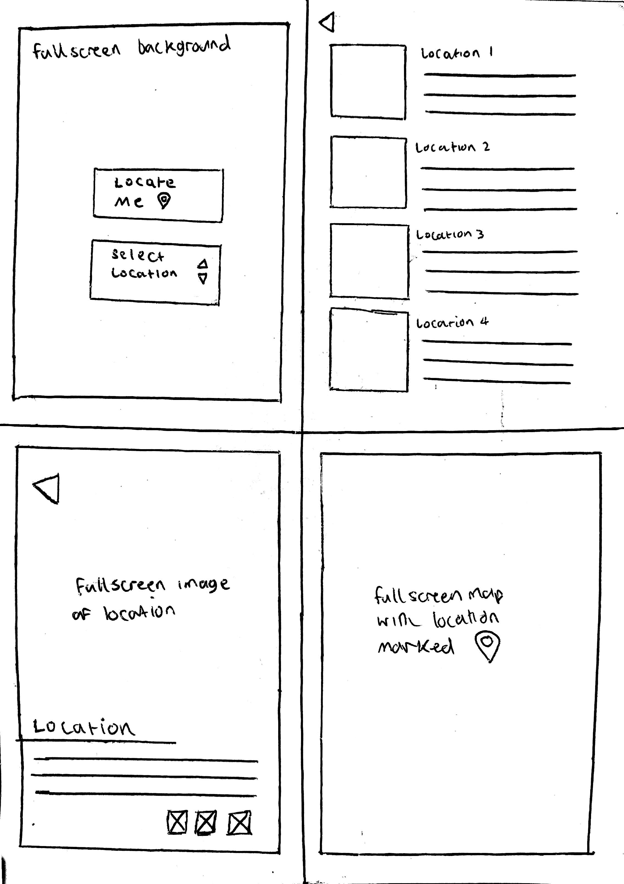
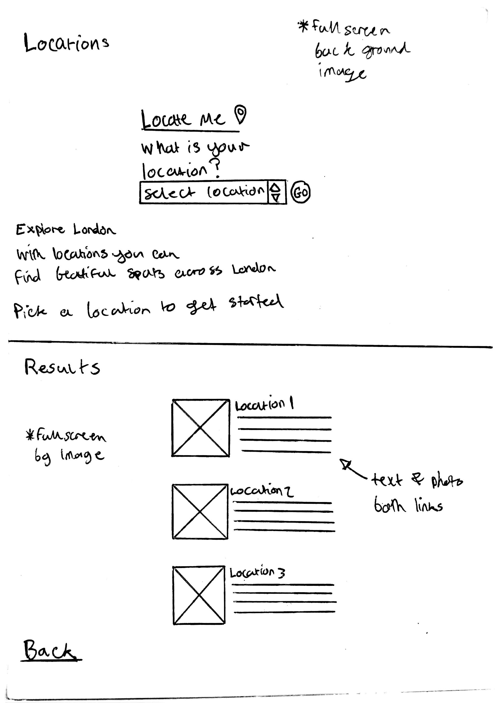
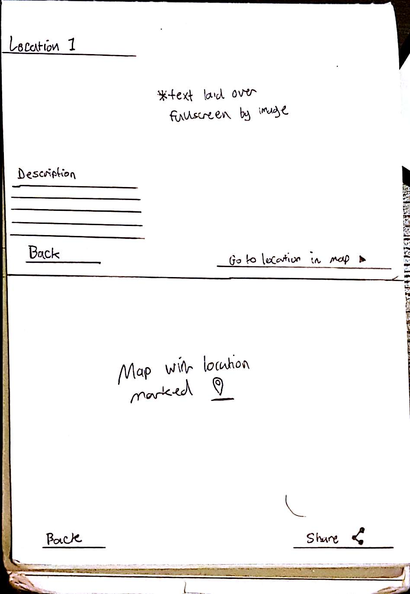
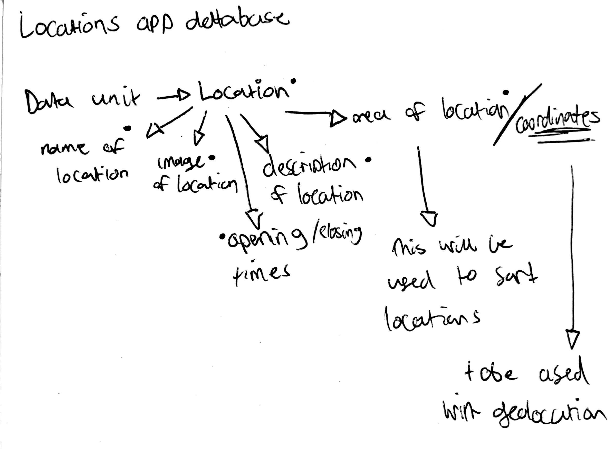
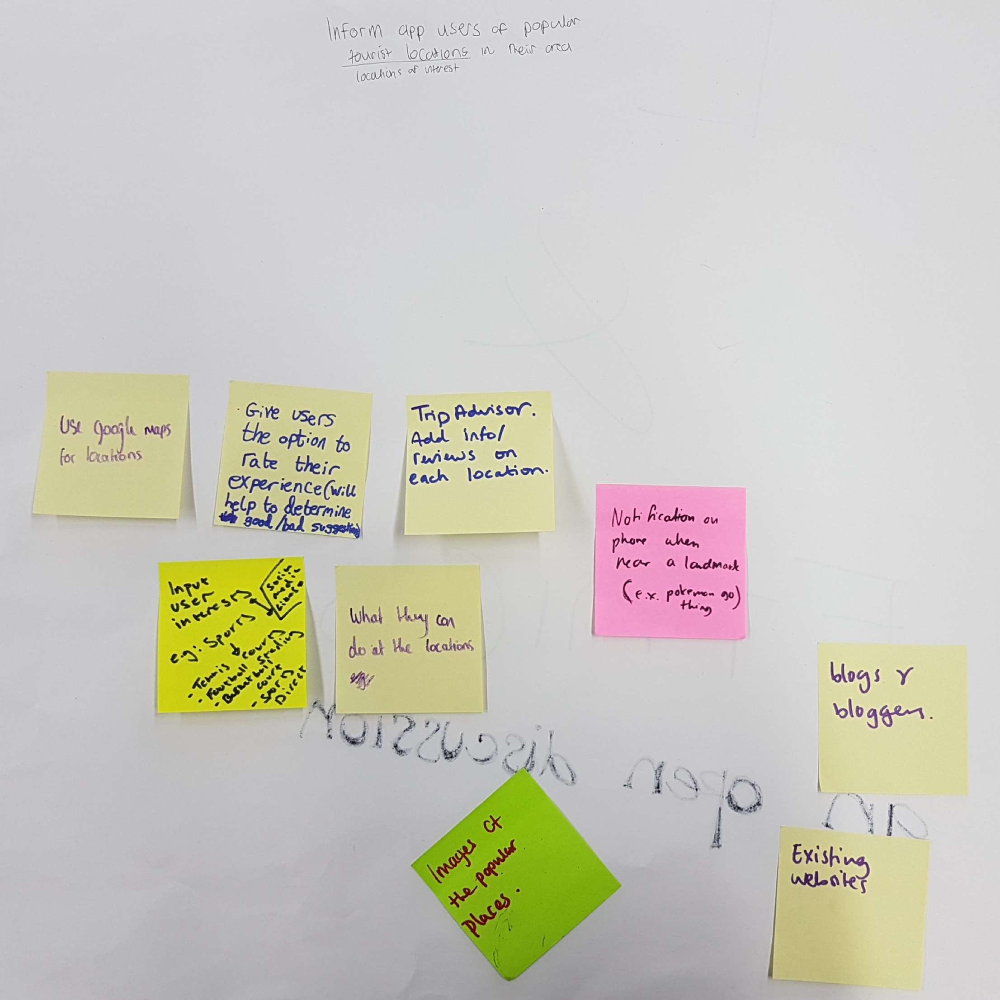

Web-14203 Rajeev Gill
===
DynamicWeb
===
Filtr-Findr
-
The brief
-
Our brief for this topic was to develop an app which helps users sort through data to find what they are looking for (Quite broad).

Initially my idea for an app which does this was called *"Locations"*. In my mind this app provides users with information about beautiful public locations for walkers, explorers, tourists etc. The app could use the google maps, street view, and geolocation api to find great public spots e.g. greenwich park. 

Users would either be able to select a location from a menu or use location services on their device to show the best spots in their area. After determining the users location the application will then show the user locations in their area which they can visit. 

After seeing the list of locations the app provides the user can then click on a location then the app will display more detailed information about the location. On this page there will be options for the users to check in there on facebook or twitter and look at the location on the map. For the last part I plan on using the google maps or streetview API. 

What actually happened...
=
As a result of feedback recieved part way through the project I decided to change the focus of my app and target tourists - specifically *"selfie tourists"*. 

My new app called **SelfieSpot** works similarly to locations, it uses geolocation to detect a users whereabouts and then displays them a list of locations in their area I have also kept the dropdown menu functionality. 

The difference with **SelfieSpot** is that it is a parody aimed to poke fun at tourists who take an unnecessary amount of selfies. As a tourist app it will take users to locations which are supposedly good to take a selfie most people would assume Big Ben, The Shard etc whereas my app being the parody that it is will show users locations such as a carpark in Peckham!

Planning
=
Wireframe v1
------------

Wireframe v2
------------

Database plan
------------

App Idea Brainswarm
------------

Initial Prototypes
---

[See Version Here](https://github.com/RajeevG96/WEB14203-Rajeev-Gill/tree/master/Filtr%20findr%20app%20v0.1 "Title")

Version 1
---

[See Version Here](https://github.com/RajeevG96/WEB14203-Rajeev-Gill/tree/master/Filtr%20Findr%20app%20v0.2 "Title")
Version 2
---

[See Version Here](https://github.com/RajeevG96/WEB14203-Rajeev-Gill/tree/master/filtr-findr%20app%20v2 "Title")

Version
---

[See Final Version Here](https://rajeevg96.github.io/filtr-findr-app/ "Title")
=

Links
===

[Formative Presentation](https://docs.google.com/presentation/d/1w2VEdbTsNX34znHJFqFK_ojR29ZbpcwKc3JIjYPrM2o/edit?usp=sharing "Title")

[Formative Presentation](https://docs.google.com/presentation/d/1LuSUYUNCwYRjNuLQA189I7l13X8lmqNi725C_uLdwS8/edit?usp=sharing "Title")

[App Link](https://rajeevg96.github.io/filtr-findr-app/ "Title")

[Blog Posts](http://rajeevxgill.co.nf/category/the-dynamic-web/ "Title")

[Firebase pusher](https://thimbleprojects.org/rajeevg96/127104)

